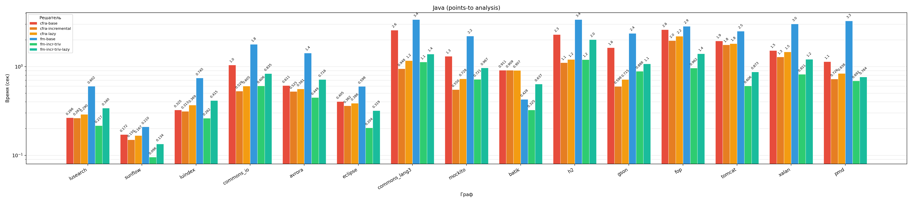
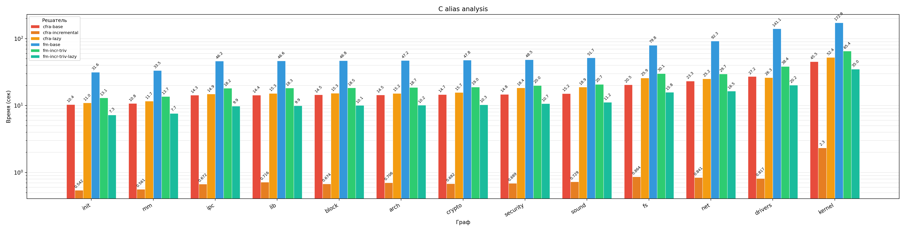
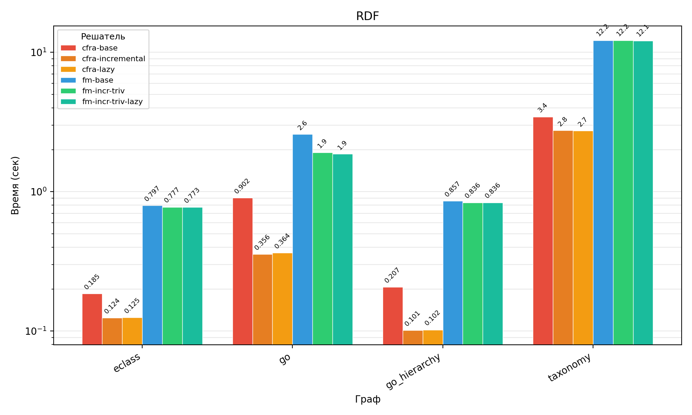
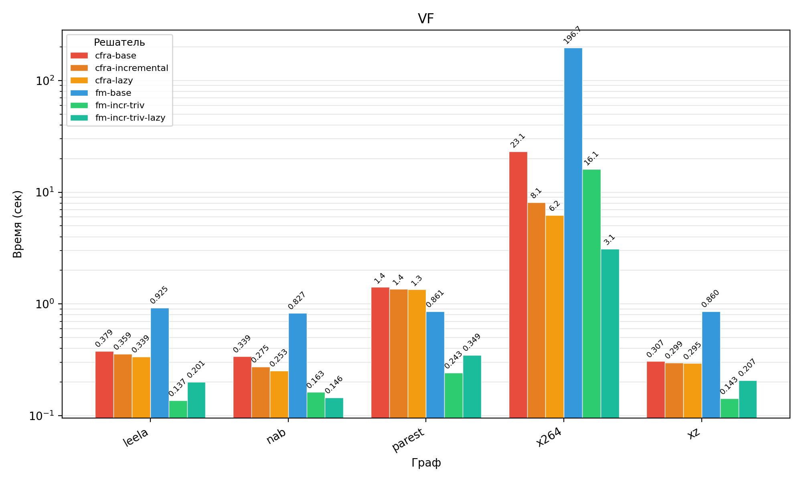

# CFRA

**CFRA** (Context-Free Reachability Analyzer) is a GPU-accelerated solver for the Context-Free Language Reachability (CFL-R) problem, based on sparse Boolean linear algebra operations. It uses the [cuBool](https://github.com/SparseLinearAlgebra/cuBool) library to perform matrix operations on NVIDIA CUDA.

The implementation is based on the matrix CFL-reachability algorithm by [R. Azimov](https://doi.org/10.1145/3210259.3210264) and optimizations proposed by [I. Muravev](https://github.com/FormalLanguageConstrainedPathQuerying/CFPQ_PyAlgo).

## Features

* Three variants of the matrix CFL-reachability algorithm:
  * **Base** - `M = M + M * M` until fixed point
  * **Incremental** - operates only on the delta of new pairs, O(n^4) instead of O(n^5)
  * **Incremental with lazy addition** - M is stored as a set of chunks, theoretical complexity O(n^3)
* Trivial operation optimization: skipping multiplications and additions with empty matrices via nvals caching
* Template CNF grammar support (POCR format): automatic expansion templates
* Benchmark system for comparison with other solvers

## Requirements

* Linux (tested on Ubuntu 22.04)
* CMake >= 3.15
* GCC with C++20 support
* NVIDIA CUDA Toolkit (for GPU backend)

## Build

```bash
git clone https://github.com/vano105/cfra.git
cd cfra
git submodule update --init --recursive

cmake -B build -S .
cmake --build build
```

To build without CUDA (CPU only):

```bash
cmake -B build -S . -DCUBOOL_WITH_CUDA=OFF
cmake --build build
```

## Usage

```bash
./build/cfra --grammar <grammar.cnf> --graph <graph.csv> [options]
```

**Options:**

| Argument | Description |
| --- | --- |
| `--algo base` | Base algorithm (Azimov) |
| `--algo incremental` | Incremental algorithm (default) |
| `--algo lazy` | Incremental with lazy addition |
| `--cpu` | Force CPU backend |

**Examples:**

```bash
./build/cfra --grammar data/test_data/java/avrora/grammar.cnf \
             --graph data/test_data/java/avrora/avrora.csv \
             --algo lazy

./build/cfra --grammar data/test_data/c_alias/kernel/grammar.cnf \
             --graph data/test_data/c_alias/kernel/kernel.csv \
             --algo incremental --cpu
```

**Output format:**

```
Graph: 24690 vertices, 3136 labels, 50392 edges
Expanded grammar: 4 epsilon rules, 2 terminal rules, 0 chain rules, 6009 complex rules, 6869 nonterminals
AnalysisTime: 0.748
#SEdges: 183043
```

## Input Format

**Graph** (`*.csv`):

```
0 1 assign
1 2 load_i_3
2 3 store_i_3
3 0 alloc
```

**Grammar** (`*.cnf`) - CFG rules in CNF format:

```
PT alloc
PT PT alloc
PT assign
PT assign PT
PT load_i AS_i
...
Count:
PT                      # start nonterminal
```

Symbols ending with `_i` are automatically expanded using indices found in the graph.

## Benchmarking

The benchmark system allows automatic comparison of CFRA with other solvers:

```bash
./bench/bench.sh --config bench/bench_config.sh --runs 3
```

## Experimental Comparison

### Solvers

I compare **CFRA** (this project) against **[FastMatrix](https://github.com/FormalLanguageConstrainedPathQuerying/CFPQ_PyAlgo)** - the optimized matrix CFL-reachability solver by I. Muravev.

| Solver | Language | Linear algebra backend
| --- | --- | --- 
| **CFRA** (cfra) | C++ | [cuBool](https://github.com/SparseLinearAlgebra/cuBool) (CUDA GPU)
| **FastMatrix** (fm) | Python | [SuiteSparse:GraphBLAS](https://github.com/DrTimothyAldenDavis/GraphBLAS) (CPU)

Configurations compared:

| Config name | Optimizations enabled
| --- | ---
| `cfra-base` | None 
| `cfra-incr` | Incremental + trivial operations
| `cfra-incr-lazy` | Incremental + trivial operations + lazy add
| `fm-base` | None
| `fm-incr-triv` | Incremental + trivial operations
| `fm-incr-triv-lazy` | Incremental + trivial operations + lazy add

## Datasets

I use the [CFPQ_Data](https://github.com/FormalLanguageConstrainedPathQuerying/CFPQ_Data) and [CPU17](https://github.com/kisslune/CPU17-graphs) datasets, which used to benchmark original I. Muravev algorithm optimizations [Muravev](https://github.com/FormalLanguageConstrainedPathQuerying/CFPQ_PyAlgo). The dataset contains four groups of graphs, each paired with a corresponding grammar:

### Java - field-sensitive points-to analysis (15 graphs)

| Graph          | Vertices   | Edges      | #SEdges     |
|----------------|------------|------------|-------------|
| lsearch        | 15,774     | 29,988     | 9,242       |
| sunflow        | 15,464     | 31,914     | 16,354      |
| gson           | 14,114     | 34,934     | 56,325      |
| commons_io     | 26,188     | 62,428     | 24,020      |
| luindex        | 18,532     | 34,750     | 9,677       |
| eclipse        | 41,383     | 80,400     | 21,830      |
| avrora         | 24,690     | 50,392     | 21,532      |
| batik          | 60,175     | 126,178    | 45,968      |
| commons_lang3  | 40,970     | 96,854     | 27,553      |
| h2             | 44,717     | 113,366    | 92,038      |
| mockito        | 25,436     | 62,388     | 16,169      |
| fop            | 86,183     | 166,032    | 76,615      |
| tomcat         | 111,327    | 221,768    | 82,424      |
| xalan          | 58,476     | 125,516    | 52,382      |
| pmd            | 54,444     | 118,658    | 60,518      |

### C alias - field-insensitive alias analysis (14 graphs)

| Graph    | Vertices   | Edges            | #SEdges                |
|----------|------------|------------------|------------------------|
| init     | 2 446 224  | 4 225 618        | 3 783 769              |
| mm       | 2 538 243  | 4 382 158        | 3 990 305              |
| ipc      | 3 401 022  | 5 862 996        | 5 249 389              |
| lib      | 3 401 355  | 5 863 760        | 5 276 303              |
| block    | 3 423 234  | 5 902 786        | 5 351 409              |
| arch     | 3 448 422  | 5 940 484        | 5 339 563              |
| crypto   | 3 464 970  | 5 976 774        | 5 428 237              |
| security | 3 479 982  | 6 006 652        | 5 593 387              |
| sound    | 3 528 861  | 6 099 464        | 6 085 269              |
| fs       | 4 177 416  | 7 218 746        | 9 646 475              |
| net      | 4 039 470  | 7 000 282        | 8 833 403              |
| drivers  | 4 273 803  | 7 415 538        | 18 825 025             |
| kernel   | 11 254 434 | 18 968 426       | 16 747 731             |

### RDF - same-level concept search (4 graphs)

| Graph      | Vertices | Edges     | #SEdges   |
|------------|----------|-----------|-----------|
| go_h       | 45007    | 980218    | 588976    |
| eclass     | 239111   | 720496    | 90994     |
| go         | 582929   | 2874874   | 640316    |
| taxonomy   | 5728398  | 29844250  | 151706    |

### VF - context-sensitive data flow analysis (5 graphs)

| Graph    | Vertices | Edges     | #SEdges       |
|----------|----------|-----------|---------------|
| xz       | 30 492   | 37 173    | 358 834       |
| nab      | 31 215   | 37 484    | 739 646       |
| leela    | 47 665   | 63 996    | 662 466       |
| parest   | 233 900  | 307 850   | 1 342 540     |
| x264     | 138 702  | 201 034   | 20 259 480    |

These datasets were chosen because they cover the four main application domains of CFL-reachability in static analysis.

## Performance

Benchmarked on: PC with Ubuntu 22.04, Intel Core i5-11400f 2.6GHz CPU, DDR4 16Gb RAM, Nvidia RTX 3050 GPU with 8Gb VRAM. 






### Performance Analysis

**C alias analysis (small grammar, large matrices):** CFRA consistently outperforms FastMatrix by **2-12x**. The grammar has only 12 fixed rules, so each iteration performs a small number of large MxM operations on matrices with millions of nonzeros - the ideal workload for GPU parallelism.

**Java points-to analysis (template grammar, ~858 indices):** CFRA is **1.5-2x slower** than FastMatrix. The template grammar expands to hundreds of indexed rules, resulting in hundreds of individual MxM calls per iteration on very sparse matrices. Each cuBool kernel launch incurs a fixed overhead (~10-50 us) that dominates when the actual computation takes microseconds. The planned **block matrix optimization** ([Muravev](https://github.com/FormalLanguageConstrainedPathQuerying/CFPQ_PyAlgo), Section 3.7) addresses this by replacing hundreds of small MxM calls with a single large block-matrix multiplication.

**VF - context-sensitive data flow (template grammar, moderate indices):** CFRA is **2-8x faster** than the FastMatrix baseline. The template grammar (`call_i` / `ret_i`) has fewer indices than Java points-to, so GPU kernel launch overhead is less critical.

**RDF (small grammar, very sparse matrices):** FastMatrix is **1.5-4x faster**. Despite the simple grammar (2-3 rules), matrices are extremely sparse, so individual operations are too lightweight for GPU parallelism to compensate for kernel dispatch overhead.

## Project Structure

```
cfra
├── bench                              - benchmark system
│   ├── bench.sh                       - benchmark runner script
│   ├── bench_config.sh                - configuration: solvers, datasets
├── cuBool                             - dependency: cuBool library (submodule)
├── src
│   ├── base_algo/                     - base algorithm
│   ├── incremental_algo/              - incremental algorithm
│   ├── lazy_algo/                     - incremental with lazy addition
│   ├── matrix_store/                  - matrix storage with nvals caching
│   ├── grammar/                       - grammar parsing and template expansion
│   ├── graph/                         - graph loading
├── test_data                          - small test grammars and graphs
└── CMakeLists.txt
```

## References

* Azimov R. - [Context-free path querying by matrix multiplication](https://doi.org/10.1145/3210259.3210264)
* Muravev I. - Optimization of a context-free reachability algorithm based on linear algebra operations. [Repository](https://github.com/FormalLanguageConstrainedPathQuerying/CFPQ_PyAlgo)
* [cuBool](https://github.com/SparseLinearAlgebra/cuBool) - sparse Boolean linear algebra library for NVIDIA CUDA
* [SuiteSparse:GraphBLAS](https://github.com/DrTimothyAldenDavis/GraphBLAS) - library used in FastMatrix
* [CFPQ_Data](https://github.com/FormalLanguageConstrainedPathQuerying/CFPQ_Data) - benchmark dataset for CFL-reachability problems

## Author

Khromov Ivan, Saint Petersburg State University, 2025.